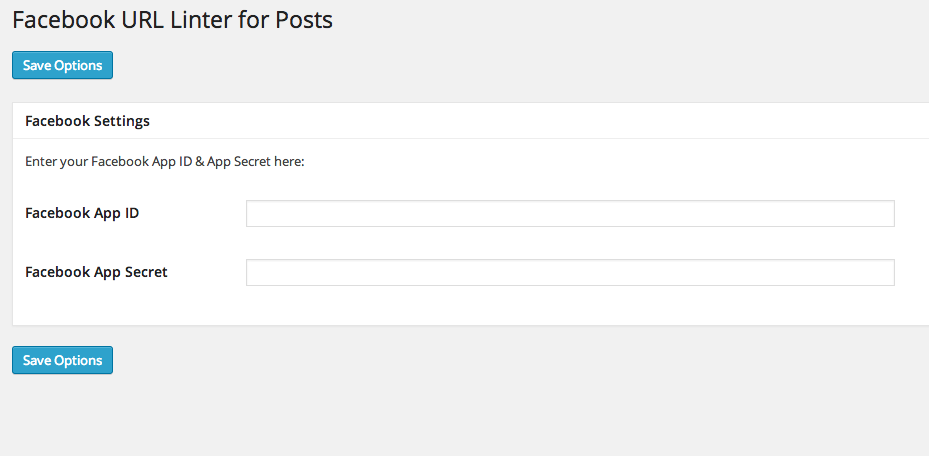

WordPress Post FB URL Linter
============================

<h2>Description</h2>

This Plugin allows you to send any published or updated post to Facebook scraper

<h2>Installation</h2>

1. Upload `facebook-force-lint.zip` onto your local computer.
2. Go to your WordPress Dashboard and select <strong>Plugins >> Add New</strong>.
3. Click on the <strong>Upload</strong> option at the top and select the `facebook-force-lint.zip` you just downloaded.
4. Click on <strong>Install</strong>.
5. Activate the plugin through the 'Plugins' menu in WordPress
6. There should be an additional Facebook URL Linter sub-menu under the Settings option of your Dashboard.
7. Clicking on the Facebook URL Linter sub-menu will cause shiba-example-page.php to be executed. 

<h2>Frequently Asked Questions</h2>

<strong>Why do I need this plugin</strong>

The plugin allows the users to send their new & updated WordPress blog posts to the Facebook scraper automatically.
It helps users to avoid unneccesary Facebook errors, and keep facebook updated with every update on old posts.

<strong>How this plugin Works</strong>

Each time a user is posting new article or updating existing post, the plugin sends the permalink url to the <a href="https://developers.facebook.com/tools/debug/">Facebook URL Linter / Debugger</a> and forces Facebook to re-fetch post information.

This plugin is utilizing <a href="https://github.com/facebookarchive/facebook-php-sdk">Facebook PHP SDK (v.3.2.3)</a> for websites running PHP 5.3 and up. You can find more information about how to use the SDK <a href="https://developers.facebook.com/docs/php/gettingstarted/4.0.0">here</a>.
It uses WordPress <a href="http://codex.wordpress.org/Plugin_API/Action_Reference/publish_post">publish_post</a> & <a href="http://codex.wordpress.org/Plugin_API/Action_Reference/post_updated">post_updated</a> hooks in order to catch the neccesary events.

<h2>Screenshots</h2>

<h2>Changelog</h2>

<strong>V0.1</strong> - First version.

